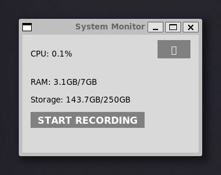
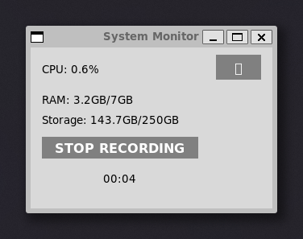
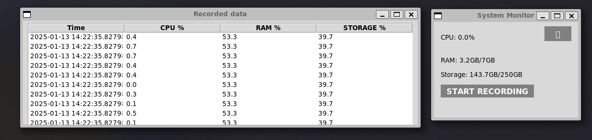

# Load Monitoring App


The Load Monitoring App is a Tkinter application designed to monitor and analyze system load metrics. It provides real-time insights into system performance, helping users identify and address potential issues promptly.

## Features

- **Real-time Monitoring**: Continuously tracks system load metrics.
- **Data Persistance**: Persist data to database for later analysis.

## Prerequisites

Before running the application, ensure you have the following installed:

- Python (version specified in `.python-version`)
- [Poetry](https://python-poetry.org/) for dependency management

## Installation

1. **Clone the Repository**:

   ```bash
   git clone https://github.com/imirghania/load_monitoring_app.git
   cd load_monitoring_app
   ```

2. **Set Up Environment Variables**:

   - Duplicate the `.env_example` file and rename it to `.env`.
   - Modify the .env file to configure necessary environment variables.

3. **Install Dependencies**:

   ```bash
   poetry install
   ```

4. **Running the application**:

   ```bash
   poetry run python monitor_app/main.py
   ```

5. **Running tests**:

   ```bash
   poetry run pytest
   ```

6. **Screenshots**:






